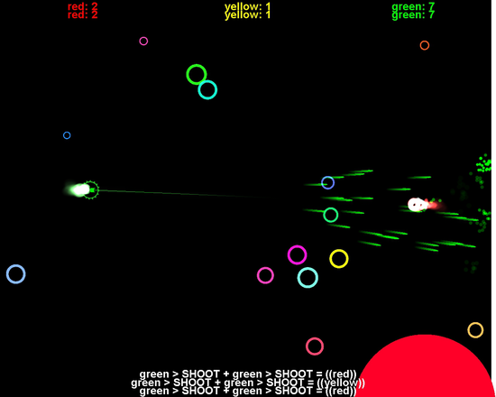

# Space Duel II

I'm [coding this live on Twitch right now](https://www.twitch.tv/occupy_paul_st).

I'm attempting to make a sequel to [Space Duel](https://paulkernfeld.com/2012/07/16/space-duel.html), a local multiplayer asteroids-style game that I made in high school. Who is better at programming: 15-year-old me or 30-year-old me?

The goals of this project are to have fun, learn some new things, and try to make a game!

To run this, do `cargo run`. It should "just work."

To get involved, check out the issues page!

# TODO

1. Control ship with keyboard

# Choosing a game engine

**The result:** Amethyst seems to be most mature, well-documented, and doesn't explicitly not support MacOS

Since I'm planning to spend single-digit hours on this project and I haven't made a game in Rust before, I want to choose a game engine that will let me get started easily. Choosing the right game engine for this kind of project could have a multiplicative effect on my productivity. I'm going to start with a shortlist of Rust game engines that I've heard of. I'm using [Are we game yet?](https://arewegameyet.com/ecosystem/engines/) as a reference. I'm going to choose from:

- [Amethyst](https://amethyst.rs/)
- [piston](https://www.piston.rs/)
- [coffee](https://github.com/hecrj/coffee)
- [ggez](https://crates.io/crates/ggez)

I'm going to do a brief writeup on each of these engines. What I'm looking for:

- Simplicity
- Good documentation, examples, and/or tutorials
- The right features for Space Duel II. That means:
  - A simple engine for 2D graphics
  - Some kind of basic physics engine, ideally
  - Lots of particle effects

What I don't really need:

- Support for 3D
- Audio support
- High performance

## Amethyst

*Data-driven game engine written in Rust*

- Has a [pong tutorial](https://book.amethyst.rs/stable/pong-tutorial.html), which seems relevant
- Robust-looking [Learn](https://amethyst.rs/doc) page. Even has [a book](https://book.amethyst.rs/stable/)!
- Looks pretty serious
- Emphasis on high performance via [Specs ECS](https://docs.rs/crate/specs)  
- Uses the `gfx-rs`, which I think is cool

## Piston

*a modular open source game engine*

- Depends on native C libraries. That's a practical move but I'm more interested in a pure Rust stack for dogmatic reasons.
- Has [some tutorials](https://github.com/PistonDevelopers/Piston-Tutorials), but only the spinning square tutorial looks complete

## Coffee

*An opinionated 2D game engine for Rust focused on simplicity, explicitness, and type-safety.*

- Big warning up front: "Coffee is in a very early stage of development. Active development is planned during 2019 (and hopefully beyond that!). Many basic features are still missing, some dependencies are experimental, and there are probably many bugs. Feel free to contribute!" 
- Has a few [examples](https://github.com/hecrj/coffee/tree/master/examples)

## ggez

*ggez is a Rust library to create a Good Game Easily.*

- "Not officially supported but might work anyway: Mac, iOS" <- unfortunately I'm on MacOS